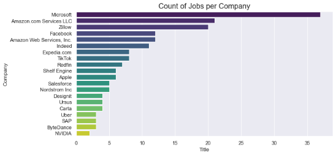
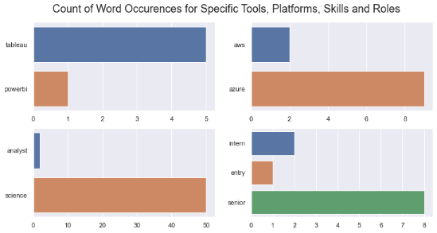
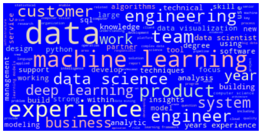
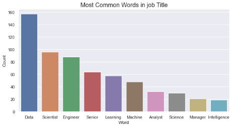

# Indeed Jobs Web Scraping and Analysis: Project Overview
-	Scraped over 1200 job descriptions from Indeed web pages
-	Visualized the companies and the locations with the highest number of job listings
-	Calculated the average minim and maxim salary 
-	Engineered features from the text of each job description to quantify the value companies put on specific tools, platforms, skills, and data science roles
-	Created a word cloud highlighting the most frequently used words in job descriptions

## Code and Resources Used
- Python 3.7
- Requests library and Beautiful Soup module for reading the HTML content and convert it to a readable format
- NumPy and Pandas libraries for data manipulation
- Matplotlib and Seaborn for visualizations
- Natural Language Toolkit (NLTK) for text analysis

## Web Scraping
I scraped more than 1200 data science jobs from Indeed.com. This involved the following steps:
- Define function to access the HTML content from the webpage
- Define function for searching and extracting all details for a job posting
- Scrape multiple webpages using specific search criteria
- Save the results in a dataframe
- Repeat scraping using different search criteria
- Merge all data into a final csv file

With each job I got the following data:
- Job Title
- Salary
- Job Description
- Company
- Location

## Data Cleaning
After scraping the data, I needed to clean it up so it can be used for analysis. I made the following changes and created new variables:
-	Remove duplicates
-	Group the jobs by Company and by Location
-	Calculate the average minim and maxim salary:
     -	drop the rows with missing values for salary and reset index
     -	check the formatting of the salary column
     -	define a function to format, calculate, and split salary in minim and maxim values
     -	create two new columns with minim and maxim salary for each job 
     -	determine the mean values of the columns with minim and maxim salary
-	Text cleaning and preparation
    -	define a function to clean the text: tokenize, convert to lowercase, replace special characters, filter the stopwords
    -	create a dictionary with each word and the sum of its occurrences in the text
    -	make a dataframe with unique words and the count for each of them
-	Create a Word Cloud using the most frequent words in job descriptions

## EDA
Using data analysis and visualizations, I tried to find answers to the following questions:
 

### Which companies have the highest number of job listings?

Notice that Microsoft has the highest number of jobs, followed by Amazon and Zillow. There are 69 companies that posted only 1 job and 28 companies that listed 2 jobs. Most companies have between 1 and 10 jobs.

 

### What is the frequency of words for specific tools and platforms, skills, and roles?

**Tableau** is the top data analytics tool while **Azure** is the preferred cloud computing platform. The roles as **data scientists** are in more demand than data analysts. Other roles like data engineer or machine learning engineer are less present. Most position types are for **senior** level, followed by intern and entry level.

### Which are the most frequent words in job descriptions?

A count of all words that occur in job descriptions and job titles highlight the importance of specific words. As Word Cloud shows, the most frequent word is **data**, followed by **machine learning**, **experience**, **engineering** and **customer**.

### What is the average minim and maxim salary?

Calculating the average salary included checking the formatting of salary values then defining a function to format, calculate and split salary in minim and maxim values. 
The results show that the **average salary** for a data scientist or data analyst role has a **minim** of **$115,887** a year and a **maxim** of **$159,665** a year.

### Which words have the highest count of occurrences in job title?

The most frequent word in job Title is **data** with almost 160 counts. It is followed by **scientist** and **engineer** with almost 100 counts. **Learning**, **machine** and **analyst** words have counts lower than 60.

